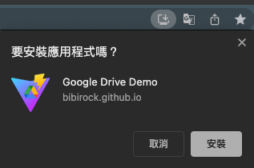

# Google Drive Demo

### 串接 Google Drive API 來模擬雲端硬碟的功能

-   檔案夾瀏覽功能，使用動態路由來傳遞參數
-   收尋檔案功能，透過即時輸入來查詢資料，與資料結果呈現頁面
-   可上傳檔案與新增資料夾，並具有視覺化提醒
-   檔案改名、移至垃圾桶、分享檔案連結，一切皆與雲端硬碟連動
-   可下載為桌面版的 PWA APP，隨時可以進行雲端硬碟的操作
-   Service Workers PWA 漸進式網站，可以透過右上網址列的安裝應用程式安裝到本機
    

## 個人專案作品採用技術如下

-   PWA 漸進式網站
-   前端框架： Vite + Vue3 + Pinia
-   串接第三方 API: Google Drive API
-   主要使用語言： TypeScript + Javascript
-   CSS 預處理器： Tailwind CSS + SASS
-   UI library： ant-design-vue
-   HTML 模板: PUG
-   GitHub 部署：gh-pages
-   多語系系統： i18n
-   plugins : mitt、axios、iconify
